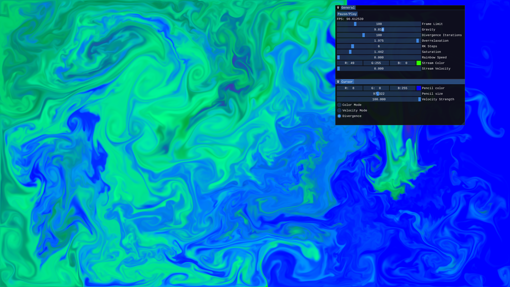

# Phisi App
A GPU-accelerated fluid simulation built with Vulkan, with a simple UI powered by ImGui.

## Requirements
- Vulkan SDK 1.4
- CMake 3.20+
- Make or Ninja
- C++20 compatible compiler

## Build
Run the following commands from the project root:

```bash
cmake -B build/ -S . -G "Ninja" -DCMAKE_BUILD_TYPE=Release
ninja -C build/
```

## Usage
```bash
.\build\bin\release\phisi_app.exe <screen_index> <pixel_ratio>
```

| Argument | Description |
|---|---|
| `screen_index` | Index of the monitor to open the borderless fullscreen window on |
| `pixel_ratio` | Physical to simulated pixel ratio. Higher values improve performance but reduce simulation resolution. A value of 2 divides the simulated pixel count by 4 |

**Example:**
```bash
.\build\bin\release\phisi_app.exe 0 1
```


